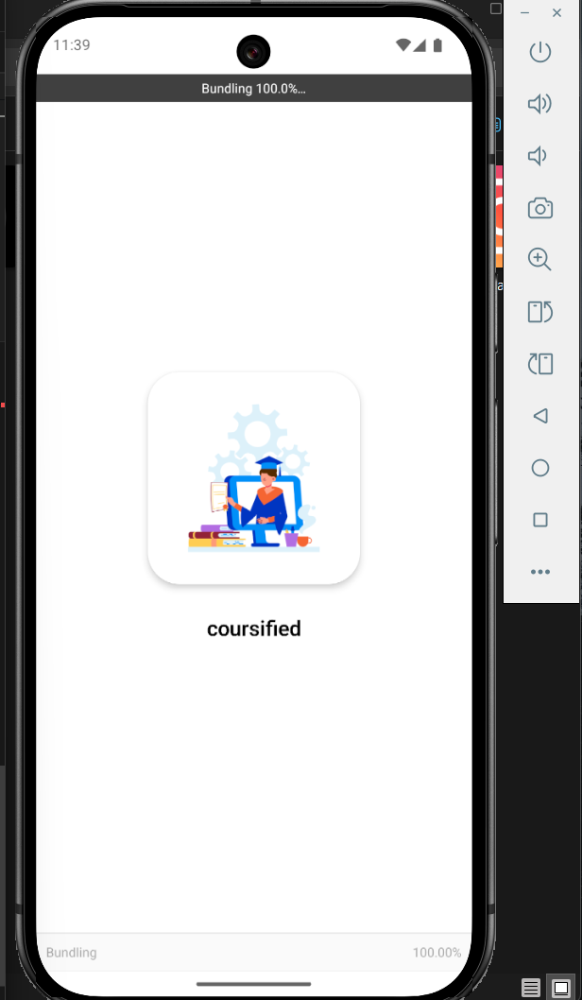
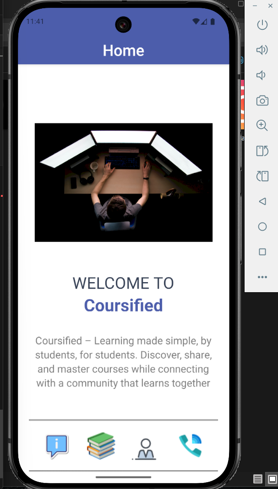
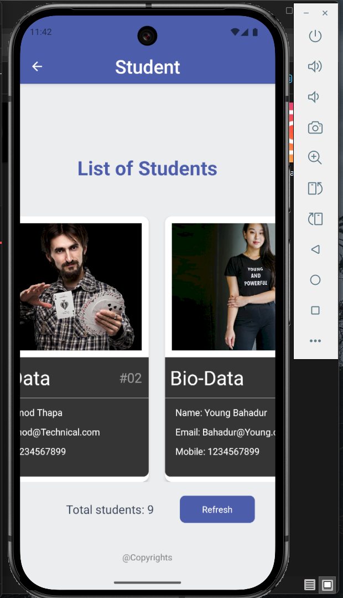

# 📚 Coursified  

> **An education app – built by students, for students.**  
Coursified is a mobile app built with **React Native + Expo**, aiming to make learning more accessible and engaging. We believe every student deserves the **Right to Education**, and this app is our step towards that mission.  

---

## 🚀 Features  
- 🎓 Browse and access courses easily  
- 📱 Clean and responsive UI built with React Native  
- 🔄 Smooth navigation with React Navigation  
- ⚡ Fast development powered by Expo  
- 🔔 Future-ready for notifications, reminders, and updates  

---

## 🛠️ Tech Stack  
- **React Native** (with Expo)  
- **JavaScript**
- **React Navigation**  

---

## 📸 Screenshots *(optional)*  
*(Add screenshots/gifs of your app once you have them!)*  

---

## ⚙️ Getting Started  

### Prerequisites  
- [Node.js](https://nodejs.org/) (>= 18.x recommended)  
- [Expo Go](https://expo.dev/client) installed on your Android/iOS device  
- Git  

<p align="center">
    
    
    
    <br>
  
   
    
</p>

### Installation  
```bash
# Clone the repository
git clone https://github.com/adrikaDwivedi/Coursified.git
cd Coursified

# Install dependencies
npm install

# Start the development server
npx expo start


